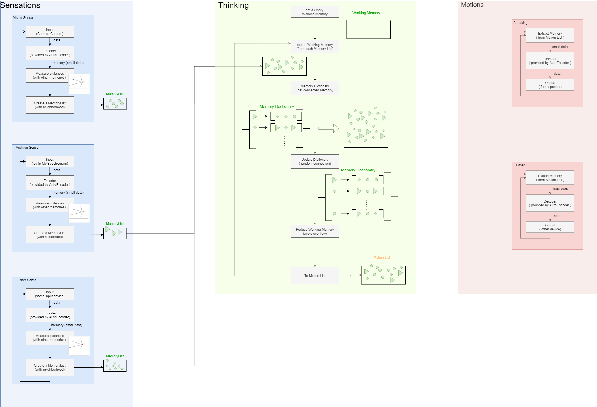
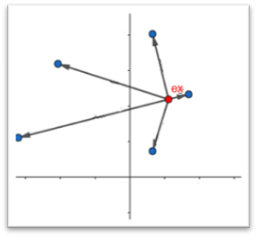

# JARVIS3
Just A Rather Very intelligent System version3  

# History
*--intro--*  
Our theory of J.A.R.V.I.S. is created by me and Kazuya Ohyanagi in summer 2020.  
We definded the "Thinking" as to connect and track a memory to other memory.
So J.A.R.V.I.S. theory produce the modeling of "Thinking" or the brain.  
  
“J.A.R.V.I.S. “ I made is very large AutoEncoder. So it isn’t completely and its object is NOT to solve problems.  

# structure
## the simple flow chart.

  
## step 1, Symbolizing  
__"Q, How does J.A.R.V.I.S process all the information as well as other information?"  
A, Quantizing.__    
J.A.R.V.I.S quantize the memory (input data through the encoder) from previous memories.[1]  
So we can change the memory to ID.

[1] previous memories is collected through the life of J.A.R.V.I.S. And the exact method is to meause the distance from the previous memory and get the memory tensor and its ID, which is the minimum distance.  

# Using
Python3.8 https://www.python.org  
Pytorch https://pytorch.org  
Anaconda3 https://www.anaconda.com/  
